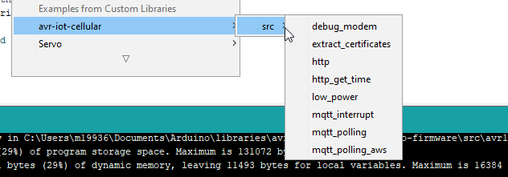

# AVR-IoT Cellular Arduino Library
[![GitHub release (latest by date)](https://img.shields.io/github/v/release/microchip-pic-avr-solutions/avr-iot-cellular-arduino-library?logo=data%3Aimage%2Fpng%3Bbase64%2CiVBORw0KGgoAAAANSUhEUgAAADAAAAAwCAYAAABXAvmHAAAACXBIWXMAAA7DAAAOwwHHb6hkAAAAGXRFWHRTb2Z0d2FyZQB3d3cuaW5rc2NhcGUub3Jnm%2B48GgAACc5JREFUaIHlmXtwVNUdxz%2B%2Fcze7ySbZPHkFoYENDwkwpVio2AqiolZ56tgZ30Jbp5axKAJCwfC2Su0gpeig0toi6piiFdTp0AFGRUWLVIsCgfCK8jIJkGSz2ce9p39s2Oyyrxsfnen0O3Nn7vnd3%2Fec3%2B%2Fc3%2F2d3zkX%2Fsch30QnurLS2RgIVFhKD1XoARZykYgUobXRPkibFk6LliNoc09QG%2F%2FqfvBgvYD%2BumN%2FZQd0ZaWzIRy4Dm3dBDIGKAOUzVFbRbNLa6qdYmzw1NTUJ9FSQBHQkL6rTuJ0ZXl3CTl%2BIeh7gG7pdLW2NcFtWljXJb9ohuzaFWqXXQQ8AFjAOeAxIJCMbNuBk0OH5jr8vhkIM4nMzDcM%2BWVpzcE17Y2pRMKrDPgCOADsSMay9cobB3gvc7T5PkRYKiJFIoKdq5NYcubiPt9pvz8JdAH%2BCZS0O5EUaR3QYHzZz%2FugpdkGXAyRsLB7dQ662DTVEzoSFW8C%2B9qNfxc4koqVcpp0ZaWzMdS2WsNPY%2FUiM6tBS7s09X2nfQDQ%2BsbSA4c22lVP6oAePjyrofnMOpDbEgidCI3OvwUA6pwqa5hn37602ec8EkJIg2poObsqmfEJEIlcXxEpvpVeIR1apm0mmAQHGvp770VzT3qaxjFyJJ7qjeSvfwFjUGVU3rE0pZ99o2dPcletJn%2F9BrIuHRU3EVozrb6i4nI7DsR5ebqiYphS1tsguSkJIqh%2B%2FfFseBGVnw%2BA1VDPuSmT0KdOxbuZIoQkLw%2FPSy9jeCsiAr%2BfpttvIbxnT6zap81B85I%2BR460pXMg%2Bgb0mDEOpawn0xkPoF0ucpc%2FguTlRbONFJfgnjcfrTNnKQD3nLmovt4OeXY27qrF4HTG6lbmOdXcdLbEOdB44tgdICMzEdz3zcBROThBnnXV1TjHjctEx3nNtThvvClBbgweTPYdd8YLNQ%2BeGtBnaLr%2BBOBweXl2vtPYA3jPMzuiq%2BPeceko8p9ZhxhG0s7M48dpmjwBfe5chHlBCBk9yvBUb0RKSpJb4%2FdzbuINmMeOxUrfKu3Z%2B0rZvj2cjKIA8pzGpA7jo37F3UtJCbnLHklpPIBRVkbOAzOTPhPDIHfZ8tTGA%2BTkkFu16MIxLm%2F4%2FNjPU1GUBhFkaupeAaXIXVCFUVaWVg3AddPNOC75frzxImTfdTeOUZdl5Dsu%2ByGuiZPiZFqxtMHr7ZXUtPoBA3qA%2FmG8WMfdS34%2Bjh9cmnFwiMy0%2B%2BEqcLliRlE4J022xQfImTkL1aVLrAlFptIrk60NxuzigvEi8pMLzIi%2FDwTQLS1kjR5jayVWJaVgmYQ%2F%2BKDdAI2uq8M5foKthU%2FcblTXLoS2bIm1YqCvuPDTFY1nP4sbS4RRGXsEAtUvE%2F7wQzuqAGRPnYbRv3%2B0HdrxDsFNr9nmO68fT9aP4tYyEZHHmwYOjPuIlCBJ0lQkhJzjJ8D5DyocpnVRFTqYdF%2BRAMlx4354IaIimVprTeuKx9ANtkocEME9fwEqLz9W2jtgBpfGCozZJcVLAM8FbLIuH03eylXo%2BnrM9hVSn2lElMIxYqS9UOpRhq6vJ7zn3xF%2Bqw%2Fd2IDzqqvt%2BVBQiDizCO%2BI28sMm1VSuH1F49mjEEmjXROIpaXkLlmGGAY5989Ede8efeZ%2F9hnMmv32DBAh51f3Y5SVRQu34KbXCO94x9aGSERw3Xo7xuAhsTJDiVp9vKzMfd6BrAtGJXfxUlS3yHZXFRTgnje%2F4%2BNra6N1ySJ0OOm6kgBVVIR7ztwOvmXhW7II3eqzNwlOJ7lVC8HhiBUPceVlzwIwZhUXLYydMdett5F9511xnRh9%2B2IdPED44AEA9IkTqJJSjCFDbBlheL2Y%2B%2Fdh1tZG%2BGfPgmnaWhcAVNdu0NJMaPdHUZmGETO7Fm2SL%2Fv19QFuAMfAi%2FFseBHc7oRO9MmTnJsyEauxMdKpx4Pnb5tRPXrYMsI6cZymieOxmpoAEKcLzwsvYiSpq5LC18K5KZMwjx6NdWKLMbukaCpQLNnZ5D%2B1FtUj%2BWoreXkoTwHBbVsj5EAA6%2FgXOK%2F7sb3cnp%2BP5LgJv%2F1WRGCaWDX7cU2c3JHp0sHpxOjdm9Cbb3B%2Br6o0rcbs4qJrRUk%2F95yHyLryqrR9GIMGEd79EVZdHQDWkcM4KiowKvplNgBwDKok%2FP57WCdORPgnT6IKC3B8d5gtvlFejnXkcEcSUXq3EpGPssZcgeuWzDtIRMiZfl80hWrLwveb5ZGYtuWBA%2FfDVYgrOyry%2F34V1uef2%2BPTvpcoLo40tHrXmHfFWJX32Io7JD8%2FPfM8tEXg%2BfVgWZFmSws0N5N1xVhbdFXaBfythHftivCDQay6OpzX32C%2FzCgsIrRtaxBlTVcF1dXvSrduJ%2BxZD8FNmxJSaKD6ZcIf7LTbBTn3Tsco6xlth7ZvI%2Fj6Ztt85%2BQpZI0d%2B2bp%2FsM1SkRagVfsEM1P9%2BBfszpBrk2T1sULwe%2B3ZYBZW4vV2FFSRMqMR9GNNssMpch99LdrBbSKtNXTgJmW1NKCb84sdCB5LWTW1uJ%2Fem3mwQMBfPPnotvi9%2BrWqVP4f%2Fe4PQfggOHx%2FAM69sQfi8gbKdW1xrd8KeGDB9OoaNqefQZz3960I%2FufWIm5b1%2FSZ4G%2FVhN%2B%2F70MtgPwuIgEod0BEdEisgAIJdMOvr6Z4KuZo0wH2iKhZCZ%2FmeGdO2n7y3Mpj1u01rQuWQytremG2auU%2BtP5RvRUQkQ%2BBhIC3Kqri9Q%2B7VknE8K7dxN4YUOicS3N%2BObPQ4eSzlEU5qFa%2FGufSvnYsqwZIhKN47iTOaVUFfBJVBAM4pszC6v9lMEOtNb4V62MLlbtQvyPLMesO5aaGMNv%2B%2BM6zL1JQ%2FEPDodjS6wgzgERaVZK3QqcAfCvWU04poCyC6upCd%2B8h9DNzaA1gT8%2FR%2BAV2wfO6EAgIRS11juUUnNFJC7%2Bkq4coVBonLXz%2FVebfzYtx27ZfCFEBCkpQQoLsQ4dsh2CsXz3rxfguu12gBql1GgROZmgl6qDhhGXTLPOND4FOFLpfNtQngI81Rv3O8rLx4lI0vhLu3af7ue9S9BrgJxvxcLM%2BCyrV%2FmEwq1ba1MpZCw%2BvqwoH42o9UT%2BHP43scllOO%2FO9KPD1k%2BEk15vV0PpJ4Cbsfsv%2BKvjrIheUFJz%2BEnJVB3Qid%2BsGqSxos%2FVlpLlaL7XGa5NtGn0S4alFpTU1tbZJXXaCD18eFZ905lrBJmOcCVf%2FyM%2FC%2Fp5sFaX1hxJXmOkwdeaxQavt5c2rIlayzhgBFAKZNofBoFjAm8Dm8M5vr93%2F%2BSUvSOKJPjGwuBARYWrQOteWkyvIBeJqGK0dhM55msWdL0lHBWHdaB079HTduL7%2FwL%2FAZqJ1CYE5LswAAAAAElFTkSuQmCC&style=flat-square)](https://github.com/microchip-pic-avr-solutions/avr-iot-cellular-arduino-library/releases/latest)

## Installation Instructions

Open the [releases tab](https://github.com/microchip-pic-avr-solutions/avr-iot-cellular-arduino-library/releases/latest) and download the latest version as a zip folder. It is found under the Assets tab. The file to download has the following naming scheme *avr-iot-cellular-a.b.c-\*.zip*.

**It is important to download the library from the releases and not clone it as a git repository.** This has to do with a library dependency to *cryptoauthlib*, which is bundled as a pre-compiled static library with the .zip file from the [releases tab](https://github.com/microchip-pic-avr-solutions/avr-iot-cellular-arduino-library/releases/latest). This is not the case if directly cloning the repository. If it is necessary to clone the repository (for the development of the library itself), see [Build Instructions](#build-instructions) further down on the page.

## Board Description

The AVR-IoT Cellular Mini is a development board from Microchip to develop cellular IoT applications.

📓 Full Arduino support through a library built on top of the open-source [DxCore](https://github.com/SpenceKonde/DxCore)

🔒 All the basic building blocks to create secure IoT applications (AVR Microcontroller, Secure Element and a Cellular Modem)

⚡ Free 150MB 90-Day SIM Card from [Truphone](https://truphone.com), providing coverage across many countries

📡 Bundled Antenna in the Box

🐞 On-Board Debugger, no need for any external tools

🔋  Battery Charging Circuitry with Connectors

🤝 Built & Designed to be Familiar to Makers, featuring a [Adafruit Feather](https://learn.adafruit.com/adafruit-feather) form-factor and a [Qwiic](https://www.sparkfun.com/qwiic) / [Stemma](https://learn.adafruit.com/introducing-adafruit-stemma-qt) Connector

## 👉 *Documentation: https://iot.microchip.com/docs/* 👈

## Examples

A set of examples can be in [src/examples](./src/examples/), and in the respective user guides on the [documentation website](https://iot.microchip.com/docs/arduino/userguide/architecture).

## Build Instructions

**A pre-built library can be downloaded from the releases tab. This section explains how to build the library locally for Linux. The process for Windows is similar. Most users do not need to build from source.**

The library depends on [MicrochipTech/cryptoauthlib](https://github.com/MicrochipTech/cryptoauthlib) to communicate with the ECC608B (Secure Element). It is added to this repository as a submodule. A CMake build configuration exists in [lib/cryptoauth](./lib/cryptoauth/), which builds `libcryptoauth.a`. Said file must be added to [./src/avr128db48](./src/avr128db48). The cryptoauth header files must be added to [./src](./src).

A script, [inject_cryptoauthlib.sh](./scripts/inject_cryptoauthlib.sh), builds the library and inserts the .a file together with the header files into the correct location.

### TLDR; How to build

1. Download and install all dependencies
	- CMake
		* `apt install cmake`
	- AVR Toolchain
		* `apt install gcc-avr avr-libc`
2. Clone this repository with the `--recursive` flag
3. Run [./scripts/inject_cryptoauthlib.sh](./scripts/inject_cryptoauthlib.sh)
